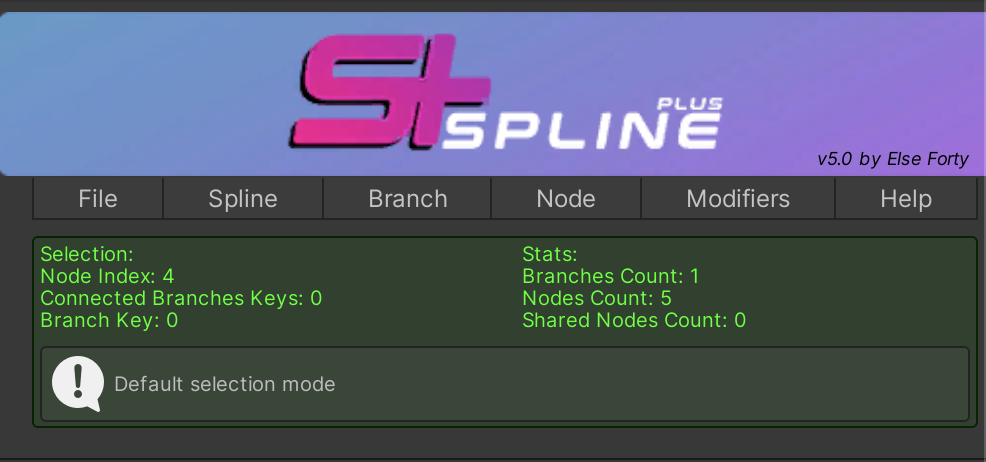
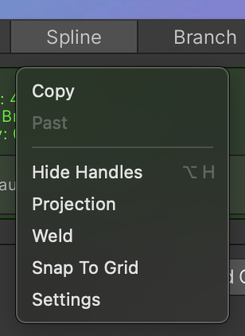
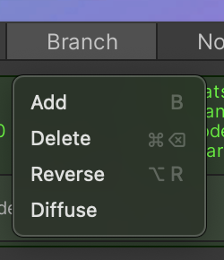
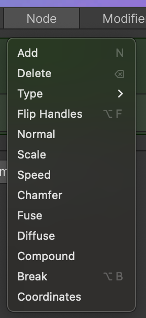

# Getting Started with Spline Plus

Once you've added the Spline Plus to your Unity project, you can access its various features and settings from the Inspector window.
 

    

## Exploring Spline Plus Features
### Accessing Spline Features

- **Spline**: The core of Spline Plus grants you access to a plethora of features, including snapping to grid, spline projection into meshes, spline nodes welding, and much more.

    

### Manipulating Branches and Nodes

- **Branches**: Under the "Branch" section, you can perform operations such as adding, removing, diffusing, and reversing the direction of branches.

    

- **Nodes**: In the "Nodes" section, you'll find various functionalities like adding, deleting, fusing, changing types, chamfering, breaking, adjusting speed scale, normals, and more.

    

### Applying Modifiers
- **Animation Modifiers**: These modifiers offer simple and group followers for spline-based animations. They come equipped with an advanced event system to facilitate interactive spline following, ideal for applications like train systems.
- **Mesh Modifiers**:  Modifiers in this category offer procedural mesh generation capabilities. Please note that the mesh generation section is a separate package available for purchase on the Unity Asset Store. It provides options such as plane mesh, tube mesh, extrude mesh, and mesh deform to create procedural meshes along the spline.

> [!IMPORTANT]
> Mesh Modifiers are not directly integrated into Spline Plus. Instead, they are part of a separate package known as Spline Mesh Deform. This package encompasses both Spline Plus functionalities and additional mesh modifiers, providing users with a comprehensive set of tools for spline manipulation and mesh deformation.

    

## Unleash Your Creativity

With Spline Plus, you have a powerful toolset at your disposal for creating intricate spline-based designs, animations, and interactive experiences in Unity. Dive in and explore the possibilities today!

---

Ready to take your Unity projects to the next level? Start leveraging Spline Plus to bring your ideas to life!
