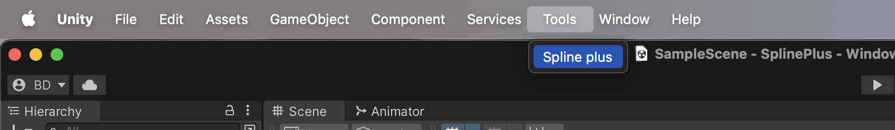
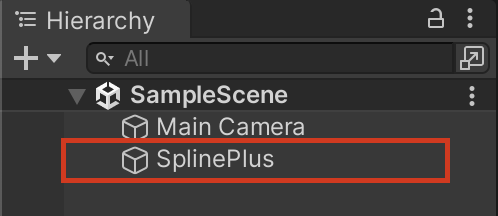

# Getting Started with Spline Plus

Welcome to Spline Plus, a powerful Unity 3D plugin for creating and manipulating splines with ease. This guide will walk you through the installation process and getting started with your first spline.

## Installation

To install Spline Plus, follow these simple steps:

1. **Package Manager**: Install the [Spline Plus][https://assetstore.unity.com/packages/tools/animation/spline-plus-115853] package from the Unity Package Manager (UPM).
2. **Add to Project**: Add all the content from the package to your Unity project.

    

Once installed, you'll notice a new toolbar button labeled "Tools". Under the "Tools" menu, you'll find "Spline Plus". Clicking on this option will create a new Spline Plus game object in your scene.

    

