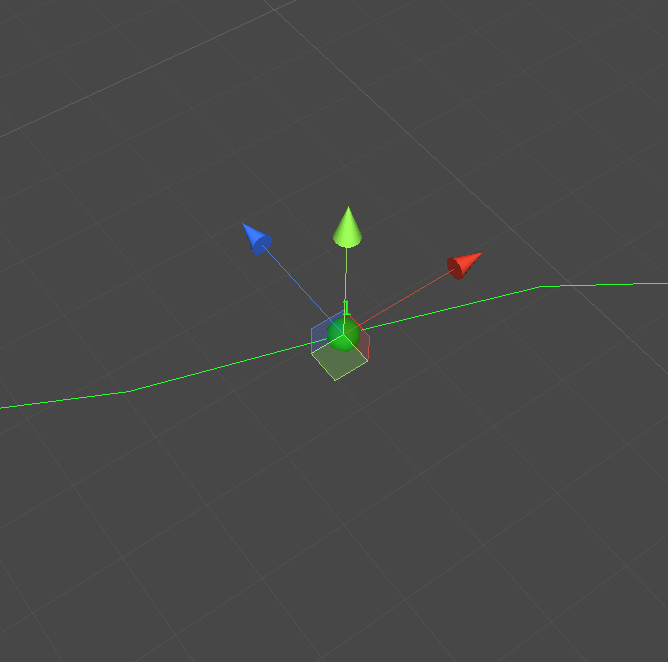
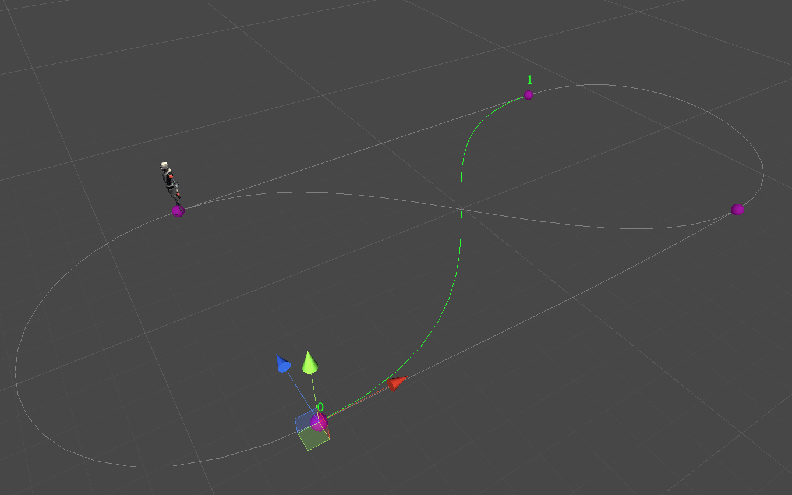
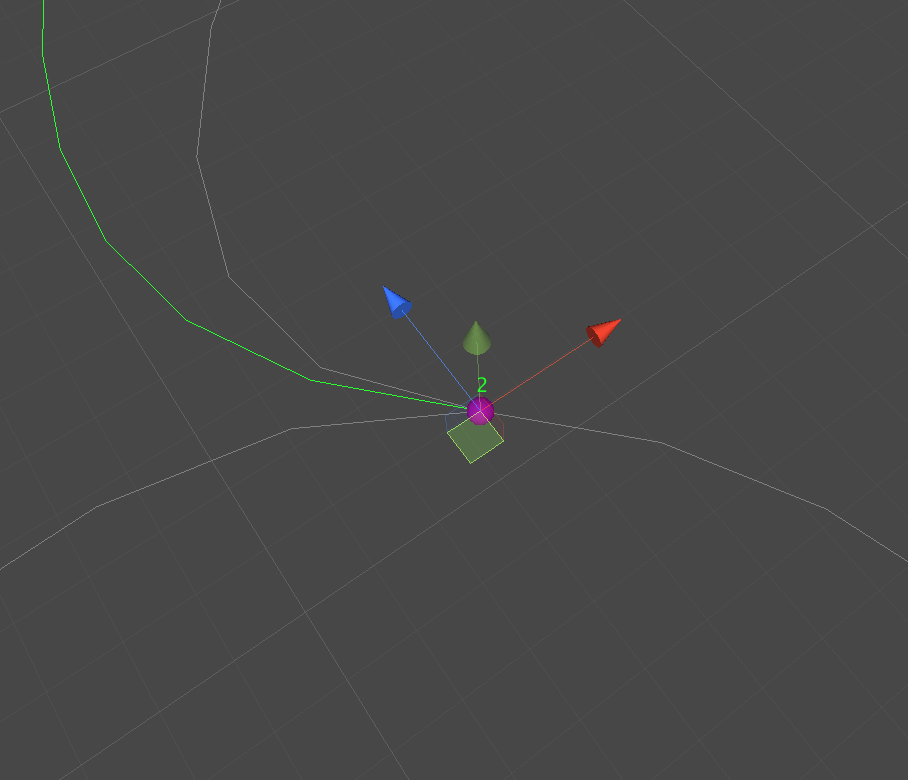

# Notions

## Node

Nodes are fundamental elements that form a branch in Spline Plus. They are visually represented in the scene view by spherical markers.

    

 

> [!TIP] 
> Double-click on a node in your scene view to select it.

## Branch

A branch is composed of nodes connected together. The selected branch is highlighted with a green color in the scene view.

    

 

> [!TIP] 
> Double-click on a branch in your scene view to select it.

## Shared Node

A shared node is a special type of node that is shared by more than one branch. It is indicated by a purple sphere in your scene view.

    

 
 
